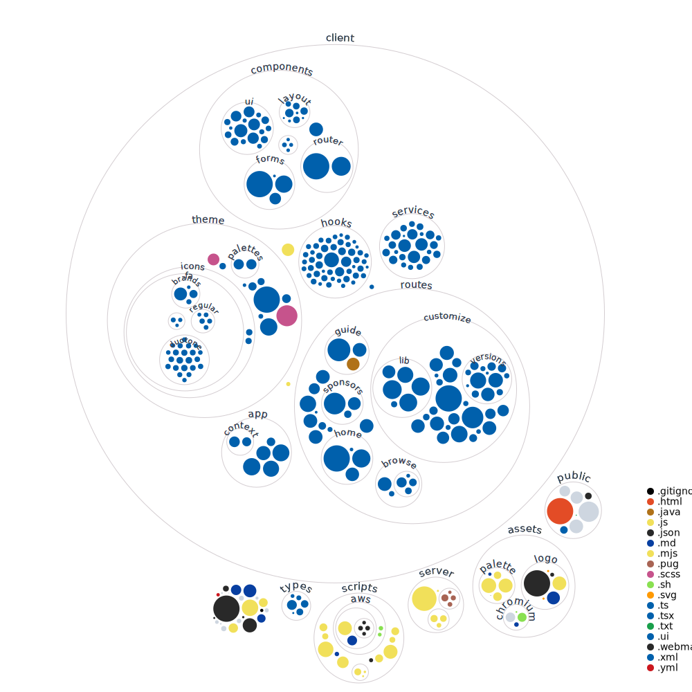

# [lwjgl.org](https://www.lwjgl.org) - Home of Lightweight Java Game Library

The website for LWJGL is build with React. It is a single-page application with client-side routing. It installs a Service Worker in order to work offline.

### Notable features:

- Client-side [routing](https://github.com/ReactTraining/react-router)
- Service Worker (works offline)
- Tiny production build (entire codebase + content weights less than 300KB gzipped)
- Code splitting at route & component level
- Scroll restoration
- Route preloading
- Proximity based route preloading (see /download page)
- Build Customizer with smart download queue & client-side ZIP generator
- Custom [webpack](http://webpack.js.org/) manifest parsing + code minification
- CSS-in-JS with [Stitches](https://stitches.dev/)
- Client is written in [Typescript](https://www.typescriptlang.org/)

### Warning:

There is currently no server-side rendering because of hosting constraints.

## Dependencies

Static assets are loaded from LWJGL's CDN ([AWS CloudFront](https://aws.amazon.com/cloudfront/)).

Build status icons are loaded directly from [travis-ci.org](https://travis-ci.org/) and [appveyor.com](https://www.appveyor.com/).

[Three.js](https://threejs.org/) is loaded from [jsDelivr](https://www.jsdelivr.com/).

## Requirements

- [Node.js v15+](https://nodejs.org/)
- [NPM v7+](https://npmjs.com/)

## Development

1.  To install all required npm packages:

```shell
npm i
```

2. To build styles:

```shell
npm run styles:dev
```

3.  To start the server in dev mode:

```shell
npm start
```

### CLI flags

The following flags are used for testing production builds locally.
NODE_ENV environment variable must be set to "production".

```shell
--test # Enables production test mode (e.g. disables HSTS)
--nocache # Disables Pug view caching
--pretty # Pretty prints HTML
--s3proxy # Proxies S3 images
```

### Environment variables

```shell
NODE_ENV="production" # default: development
PORT="8080" # default: 80
HOST="127.0.0.1" # default: 0.0.0.0
```

### Codebase Diagram



## Production

To deploy LWJGL in production please read the separate guide: [DEPLOYMENT.md](./DEPLOYMENT.md).

### Testing production builds

```shell
git pull
npm i
npm run release
```

You can run the production build locally:

```shell
npm run server:test
```

### Debugging production output

The following debugging tips may come in handy:

- Disable minification by uncommenting `minimize: false` in [webpack.config.js](./webpack.config.js)
- Prevent Terser from dropping `console.log` or `debugger` by changing `terserOptions` in [terser-config.json](./scripts/terser-config.json)
- Set `PROFILING=1` env variable to load React profiling builds
- Output `named` module & chunk ids in [webpack.config.js](./webpack.config.js)
- Analyze build output with `npx webpack-bundle-analyzer public/js/webpack.manifest.json -h 0.0.0.0` (for full breakdown, change to `all: true` when writing `webpack.manifest.json` in [build-production.js](./scripts/build-production.mjs))

## Other LWJGL subdomains:

- The website for LWJGL 2 can be found [here](https://github.com/LWJGL/lwjgl-www). A static copy of the old LWJGL website is now hosted directly from S3
- The blog is powered by [Ghost](https://ghost.org/).
- The forum is [SMF](https://simplemachines.org/).
- The wiki for LWJGL 2 was [MediaWiki](https://www.mediawiki.org/). A static copy of the old LWJGL wiki is now hosted directly from S3.
