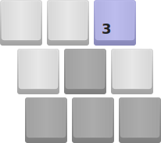
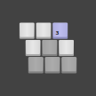

# Preview

## Logo:



## Favicon:



## Inventory

- [logo.svg](./logo.svg) - The official LWLGL logo source
- [maskable.svg](./maskable.svg) - Square icon with safe-zone for generating anything from favicons to PWA icons.

# Generate assets

## Prerequisites

- Node.js 17.5.0+
- npm

```bash
# Generating assets requires the following software:
# 1. Puppeteer for pixel perfect rendering and conversion of .SVGs to .PNGs
npm i
# 2. OptiPNG for optimizing .PNGs
docker pull jess/imagemagick
# 3. ImageMagick for combining multiple .PNGs to .ICO
docker pull buffcode/docker-optipng
# 4. Chromium container for Puppeteer
cd ../chromium
docker build --rm -t headless-chrome .
./run.sh
```

## Artifacts

[cheat sheet](https://github.com/audreyr/favicon-cheat-sheet)

```bash
# Favicon
node --experimental-fetch --no-warnings render.mjs logo.svg dist/favicon-16x16.png --width 16 --height 16
node --experimental-fetch --no-warnings render.mjs logo.svg dist/favicon-32x32.png --width 32 --height 32
node --experimental-fetch --no-warnings render.mjs logo.svg dist/favicon-48x48.png --width 48 --height 48
node --experimental-fetch --no-warnings render.mjs logo.svg dist/favicon-192x192.png -w 192 -h 192 --bg="#424242" --avatar -r 96
node --experimental-fetch --no-warnings render.mjs logo.svg dist/favicon-512x512.png -w 512 -h 512 --bg="#424242" --avatar -r 256

# apple-touch-icon
node --experimental-fetch --no-warnings render.mjs logo.svg dist/apple-touch-icon-192x192.png -w 192 -h 192 --bg="#424242" --safe

# # Web App Manifest Icons
# # Places icon in  a safe zone with a radius of 2/5 (40%) of the icon size
# # https://www.w3.org/TR/appmanifest/#dfn-safe-zone
# # TODO: enable this after Chrome starts respecting "purpose": "maskable"
# node render.mjs logo.svg dist/favicon-maskable-192x192.png -w 192 -h 192 --bg="#424242" --safe
# node render.mjs logo.svg dist/favicon-maskable-512x512.png -w 512 -h 512 --bg="#424242" --safe

# Social icon
node --experimental-fetch --no-warnings render.mjs logo.svg dist/social-512x512.png -w 512 -h 512 --bg="#424242" --padding 72

# Brand name
node --experimental-fetch --no-warnings render-html.mjs brandname.html dist/brand-2048x2048.png -w 512 -h 512 -s 4

# GitHub preview
node --experimental-fetch --no-warnings render-html.mjs brandname.html dist/github-1280x640.png -w 640 -h 320 -s 2

# Optimize with OptiPNG
docker run -v $(pwd):/source --rm -it buffcode/docker-optipng -o 7 ./dist/*.png

# Merge .PNGs to .ICO
docker run -v $(pwd):/images --rm -it jess/imagemagick \
convert /images/dist/favicon-16x16.png /images/dist/favicon-32x32.png /images/dist/favicon-48x48.png /images/dist/favicon.ico

# Use icon.svg as favicon.svg in modern browsers
cp logo.svg ./dist/favicon.svg
# Use maskable.svg in .webmanifest
cp maskable.svg ./dist/maskable.svg
```

# Design Guidelines

## Viewbox

Set your SVG viewBox to `0 0 108 108`

## Safe Zones

Append the following in your SVG files to make sure icons fall in the safe zone.

```xml
<!-- Web App Manifest Safe Zone: 2/5 (40%) radius -->
<circle cx="54" cy="54" r="43.2" fill="none" stroke-width="0.5" stroke="#00B28E" />

<!-- Android Adaptive Icon Safe Zones: 36px radius -->
<circle cx="54" cy="54" r="36" fill="none" stroke-width="0.3" stroke="#B28E00" />
<rect x="36" y="28" rx="3" ry="3" width="36" height="52" fill="none" stroke-width="0.3" stroke="#000" opacity="0.1" />
<rect x="32" y="32" rx="3" ry="3" width="44" height="44" fill="none" stroke-width="0.3" stroke="#000" opacity="0.1" />
<rect x="28" y="36" rx="3" ry="3" width="52" height="36" fill="none" stroke-width="0.3" stroke="#000" opacity="0.1" />
<circle cx="54" cy="54" r="26" fill="none" stroke-width="0.3" stroke="#000" opacity="0.3" />
<circle cx="54" cy="54" r="18" fill="none" stroke-width="0.3" stroke="#000" opacity="0.3" />
```

## Sources:

- [W3 Web App Manifest - 9.4 Icon masks and safe zone](https://www.w3.org/TR/appmanifest/#icon-masks)
- [Android Adaptive Icons](https://developer.android.com/guide/practices/ui_guidelines/icon_design_adaptive)
- [Maskable​.app](https://maskable.app/)
